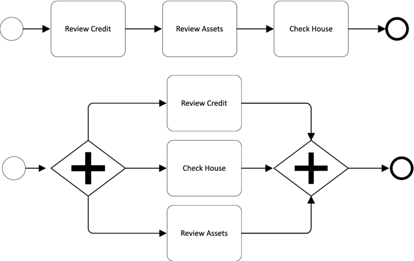

# Thinking Parallel

With Asynchronous Programming, it's now possible to have your program do more than one thing at a time. This opens a lot of possibilities but also requires you to think differently about a problem. Now when you break a problem into smaller tasks, you need to ask yourself if two tasks are:

- **Dependant**: The output of one task is required as input for the next task. These tasks must be executed _sequentially_.
- **Independent**: The output of either tasks are not required as input for the other. These tasks can be executed _in parallel_.



> Check out [./0-helpful-diagrams](./0-helpful-diagrams) for more visuals

This concept is simple enough to understand but will take lots of practice to use well. Let's look at some non-code examples:

## Case Study: Cooking Soup

The tasks for cooking (a boring) soup are:

- Chopping carrots
- Blending the cooked vegetables and water into a smooth soup
- Chopping onions
- Putting all the vegetables in the boiling water
- Heating water

Let's think about the inputs and outputs for each task:

- Chopping carrots: _whole carrots -> chopped carrots_
- Blending the soup: _cooked veggies in water -> finished soup_
- Chopping onions: _whole onions -> chopped onions_
- Boiling the vegetables: _boiling water, chopped carrots, chopped onions -> cooked veggies in water_
- Heating water: _cold water -> boiling water_

Now imagine you work in a kitchen and have lots of help. You can assign tasks to your sous-chefs so many things can be done at the same time. Which tasks could you assign _in parallel_, and which tasks must be done _in sequence_?

The numbered list shows the _sequential_ steps of the cooking process. Under each step is the tasks that can be completed _in parallel_:

1. Chop the veggies and heat the water (at the same time):
   - Chopping onions: _whole onions -> chopped onions_
   - Chopping carrots: _whole carrots -> chopped carrots_
   - Heating water: _cold water -> boiling water_
2. Use the outputs from step 1 to cook the vegetables:
   - Boiling the vegetables: _boiling water, chopped carrots, chopped onions -> cooked veggies in water_
3. When the veggies are all cooked, move on to the last step:
   - Blending the soup: _cooked veggies in water -> finished soup_
4. Serve the soup!

### Program the Recipe

What might this look like in code? Here's a possible answer:

```js
import { chop, heat, cook, blend } from './cooking.js';

// --- define the recipe ---

const prepareBoringSoup = async () => {
  // 1. chop veggies and heat the water
  //  wait for all of these tasks to be finished before moving to step 2
  //  notice the outputs are in the same order as the inputs!
  const [choppedCarrots, choppedOnions, boilingWater] = await Promise.all([
    chop('carrots'),
    chop('onions'),
    heat('water'),
  ]);

  // 2. cook the vegetables (this might take a very long time)
  const boiledVeggies = await cook(boilingWater, [
    choppedCarrots,
    choppedOnions,
  ]);

  // 3. blend the cooked veggies and water
  const soup = await blend(boiledVeggies);

  // 4. serve the soup!
  return soup;
};

// --- prepare the soup then invite your guests ---

prepareBoringSoup().then((finishedSoup) => {
  console.log('à table!', finishedSoup);
});
```

You might have noticed something you've never seen before: `Promise.all()`. This allows you to create many promises and wait for all of them to resolve _before_ moving on to the next line of code.

In the rest of this chapter you'll explore _parallel_ and _sequential_ tasks by using `Promise.all()` to fetch and process data from many users at once.

---

## More Promise Methods

There are more `Promise._` methods for parallel tasks, but you don't need to know them right now. You can explore them later when you are building your own projects. They are:

- `Promise.allSettled`
- `Promise.race`
- `Promise.any`

---

## References

- [tjsudarsan](https://dev.to/tjsudarsan/sequential-vs-parallel-processing-in-js-4gn3)
- [jrsinclair.com](https://jrsinclair.com/articles/2019/how-to-run-async-js-in-parallel-or-sequential/)
- [javascript.info](https://javascript.info/promise-api)
